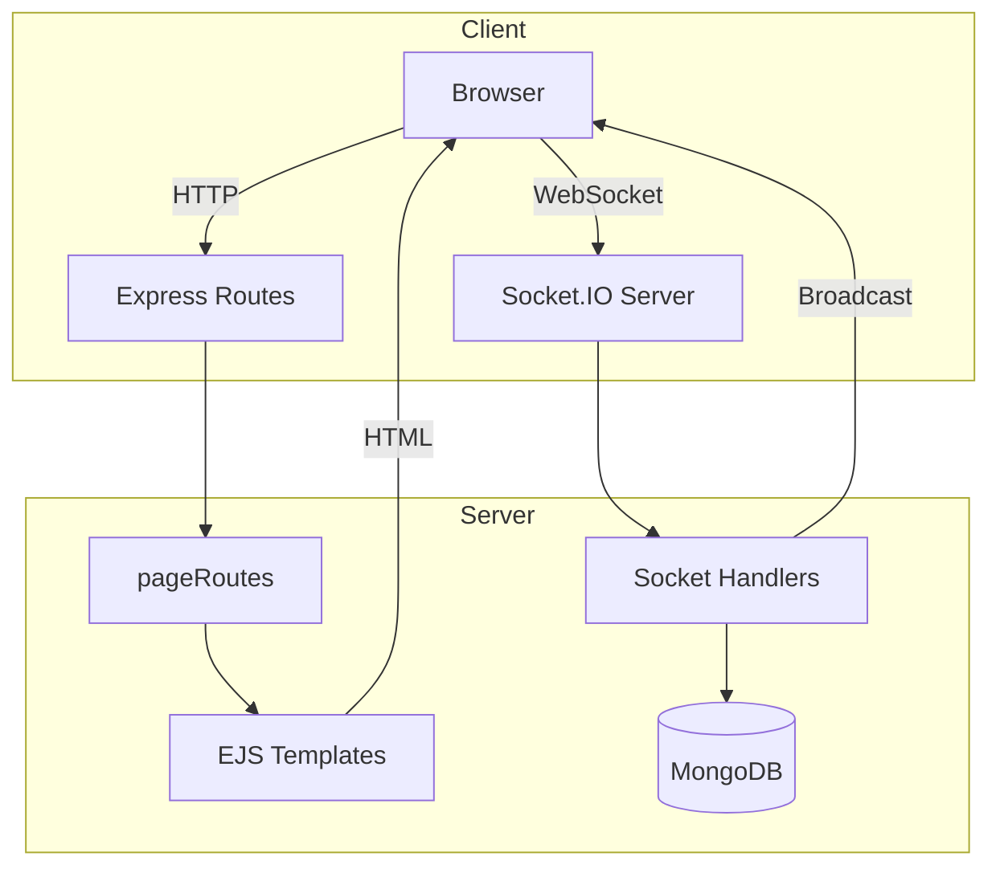

# 🎁 Giftzy - SIT725 Group Project

Giftzy is a web application built using **Node.js** that provides smart solutions for **gift recommendation**, **event planning**, and **event marking**. It is designed to assist users in making thoughtful and timely decisions for various events and special occasions.

## 💡 Project Features

- 🎁 Intelligent Gift Recommendations
- 📅 Event Planning Assistant
- 🌍 Gift Ideas Community
- ✅ Event Marking and Tracking System
- 🔐 User Authentication and Role Management

## 🛠️ Tech Stack

- **Backend**: Node.js, Express
- **Frontend**: EJS (Embedded JavaScript) Templates
- **Database**: MongoDB
- **Authentication**: JWT / Cookie-based sessions

## 👨‍👩‍👧‍👦 Team Members

| Name             | Student ID |
| ---------------- | ---------- |
| Tsz Hin Yee      | 223983938  |
| Cynthia Wijaya   | 225138694  |
| My Chi Nguyen    | 225255856  |
| Nethmi Weeraman  | 224350062  |
| Janaki Chaudhary | 224941505  |

## API Documentation

/api/users

- `GET` : Get all users

/api/users/google

- `GET` : Authenticate user login by Google

/api/users/login

- `POST` : User login

/api/users/forget-password

- `POST` : user forget password

/api/posts/addpost

- `POST` : Upload new Post

## 🚀 Getting Started

### Prerequisites

- Node.js and npm installed
- MongoDB running locally or on the cloud

### Installation

1. Clone the repository:

   ```bash
   git clone https://github.com/cynthiawjy135/WebProjectSIT725.git
   cd giftzy
   ```

2. Run the install script:

```
npm install
```

3. Make sure to create a .env file with the necessary environment variables:
   Please refer to the .env.example

```
MONGO_URI=
JWT_SECRET=
GOOGLE_CLIENT_ID=
GOOGLE_CLIENT_SECRET=
```

4. To run the project, use this command:

```
npm run start
```

5. Open your web broswer at

```
http://localhost:3000
```

6. Backend Architecture Summary



https://deakin365-my.sharepoint.com/:w:/g/personal/s223983938_deakin_edu_au/EQw_A4UQl99PktAWoutjvIkBtAvXk3CUKvHzwA9ePMLXiA?e=qI0UNy
