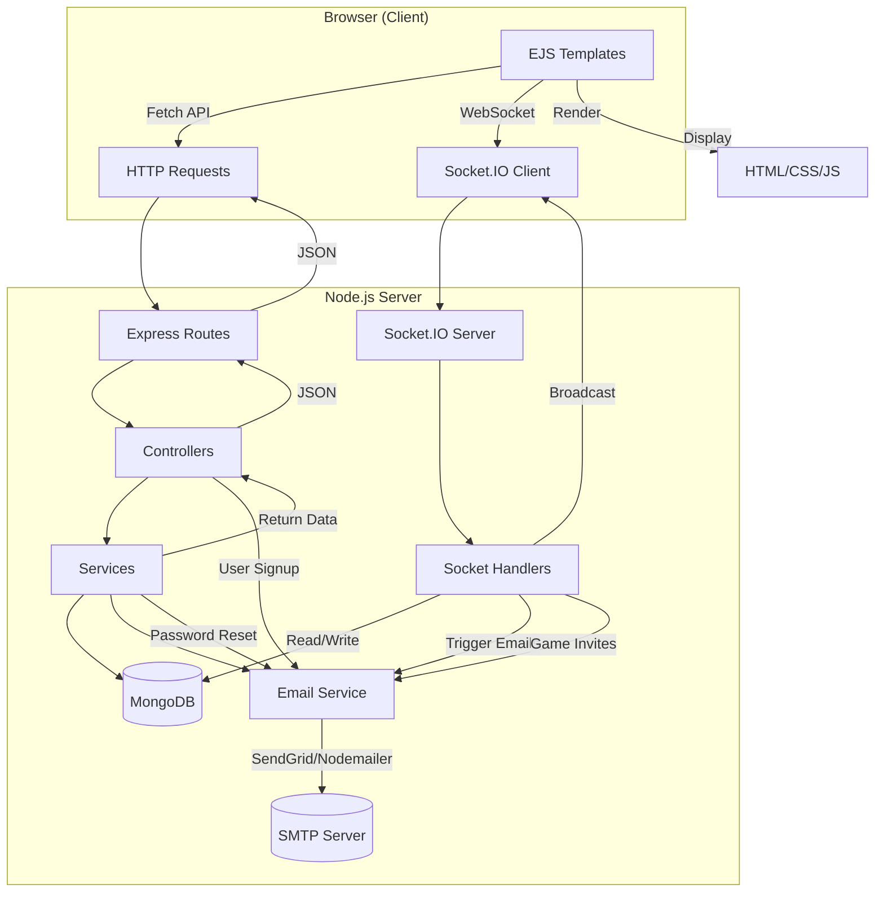

# 🎁 Giftzy - SIT725 Group Project

Giftzy is a web application built using **Node.js** that provides smart solutions for **gift recommendation**, **event planning**, and **event marking**. It is designed to assist users in making thoughtful and timely decisions for various events and special occasions.

## 💡 Project Features

- 📅 Event Planning Assistant
- 🌍 Gift Ideas Community
- 🎁 Gift Marketplace
- ✅ Event Marking and Tracking System
- 🔐 User Authentication and Role Management
- 🎁 Gift Recommendations

## 🛠️ Tech Stack

- **Backend**: Node.js, Express
- **Frontend**: EJS (Embedded JavaScript) Templates
- **Database**: MongoDB
- **Authentication**: JWT / Cookie-based sessions

## 👨‍👩‍👧‍👦 Team Members

| Name             | Student ID |
| ---------------- | ---------- |
| Tsz Hin Yee      | 223983938  |
| Cynthia Wijaya   | 225138694  |
| My Chi Nguyen    | 225255856  |
| Nethmi Weeraman  | 224350062  |
| Janaki Chaudhary | 224941505  |

## HI-FI Figma Prototype

- [**📅 Event Planning Assistant**](https://www.figma.com/proto/SkomSEUBv37MkNrlGSykxv/Event-Reminder?node-id=1-1848&p=f&t=VgbUJUZ9nTjrLNsE-1&scaling=scale-down&content-scaling=fixed&page-id=0%3A1&starting-point-node-id=1%3A1848&show-proto-sidebar=1)
- [**🌍 Gift Ideas Community**](https://www.figma.com/proto/yrB3WDk7yrwd1viMnE9Mpp/GiftzyWebProject?node-id=607-27&t=1fn8KJwkaiQzboOE-1&scaling=scale-down&content-scaling=fixed&pageid=1669%3A162202&starting-point-node-id=607%3A27)
- **🛒 Gift Marketplace** :
- **✨ Secret Angel Game** :
- [**🎁Gift Recommendations** :](https://www.figma.com/design/eYVMqe8pcDNxO87Vr5MK6v/SIT725-Wireframes?node-id=1-2&t=S7klg0PxhvFi3bn7-1)

## API Documentation

/api/users

- `GET` : Get all users

/api/users/google

- `GET` : Authenticate user login by Google

/api/users/login

- `POST` : User login

/api/users/forget-password

- `POST` : user forget password

/api/posts/addpost

- `POST` : Upload new Post

/api/posts/loadMorePosts

- `GET` : Load more 5 Posts

/api/posts/like/:postId

- `POST` : Toggle like a post

/api/communityMainPage

- `GET` : Load gift ideas community page

/api/detailPostPage

- `GET` : Load detail post page

/api/posts/quizSubmit

- `POST` : Submit quiz answers and receive gift suggestions

/quizForm

- `GET` : Load multi-step quiz form

/quizAdminLogin

- `GET` : Render admin login page
- `POST` : Validate admin login

/quizAdminDashboard

- `GET` : Show all quiz submissions (admin only)

/quizAdmin/delete/\:id

- `POST` : Soft delete a quiz submission

/quizAdmin/restore/\:id

- `POST` : Restore a soft-deleted quiz submission

/api/eventReminder

- `GET` : Load all events on to calendar

/api/eventReminder/create

- `POST` : Upload/Create new event

/api/eventReminder/edit/:id

- `PUT` : Edit/Update selected event

/api/eventReminder/bulk-delete

-`DELETE`: Delete selected events


## API Documentation
/api/users
- `GET` : Get all users

/api/users/google
- `GET` : Authenticate user login by Google

/api/users/login
- `POST` : User login

/api/users/forget-password
- `POST` : user forget password

/api/posts/addpost
- `POST` : Upload new Post

# 🚀 Gift Marketplace APIs

Users can log in as **guest**, **seller**, or **buyer** and exchange gifts in this vibrant digital marketplace.

---

## 🎁 Gift Routes
## 🚀 Users can log in as guest, seller, or buyer and have exchange of goods in this market

### `GET /gifts`
- View all available gifts (accessible to guests and logged-in users)

### `GET /gifts/add`
- Show the form to add a new gift (only for authenticated sellers)

### `POST /gifts/add`
- Add a new gift to the marketplace

### `GET /gifts/:id`
- View a specific gift by its ID

### `GET /gifts/:id/edit`
- Show the edit form for a gift (seller-only)

### `POST /gifts/:id/edit`
- Save changes to an existing gift

### `POST /gifts/:id/delete`
- Delete a specific gift (seller-only)

---

## ⭐ Review Routes

### `POST /gifts/:id/review`
- Add a review for a gift (logged-in users only)

### `GET /gifts/:id/reviews`
- Get gift details with populated reviews

---

## 🛒 Cart Routes

### `GET /gifts/cart`
- View current user's cart

### `POST /gifts/cart/add/:id`
- Add a gift to the cart

### `POST /gifts/cart/remove/:id`
- Remove a specific item from the cart

### `POST /gifts/cart/clear`
- Clear the entire cart

---

## 💬 Chat Routes

### `POST /gifts/chat/:giftId`
- Initiate or view the chat room for a specific gift

### `GET /gifts/chat/:giftId/history`
- Fetch chat history for a specific gift

### `POST /gifts/chat/:giftId/verified`
- Mark chat as sale successful


## 🚀 Getting Started

### Prerequisites

- Node.js and npm installed
- MongoDB running locally or on the cloud

### Installation

1. Clone the repository:

   ```bash
   git clone https://github.com/cynthiawjy135/WebProjectSIT725.git
   cd giftzy
   ```

2. Run the install script:

```
npm install
```

3. Make sure to create a .env file with the necessary environment variables:
   Please refer to the .env.example

```
MONGO_URI=
JWT_SECRET=
SESSION_SECRET=
GOOGLE_CLIENT_ID=
GOOGLE_CLIENT_SECRET=
```

4. To run the project, use this command:

```
npm run start
```

5. Open your web broswer at

```
http://localhost:3000
```

6. Backend Architecture Summary



_Diagram created by Tsz Hin Yee (223983938)_

https://deakin365-my.sharepoint.com/:w:/g/personal/s223983938_deakin_edu_au/EQw_A4UQl99PktAWoutjvIkBtAvXk3CUKvHzwA9ePMLXiA?e=qI0UNy

7. Test Cases Doc For User and Secret Angel related logic

https://deakin365-my.sharepoint.com/:w:/g/personal/s223983938_deakin_edu_au/EawNYWgHuZ5NmokfaoKF5BIBbbR8fsUuaIEbLx8ngDJX2Q?e=hqAQsf
